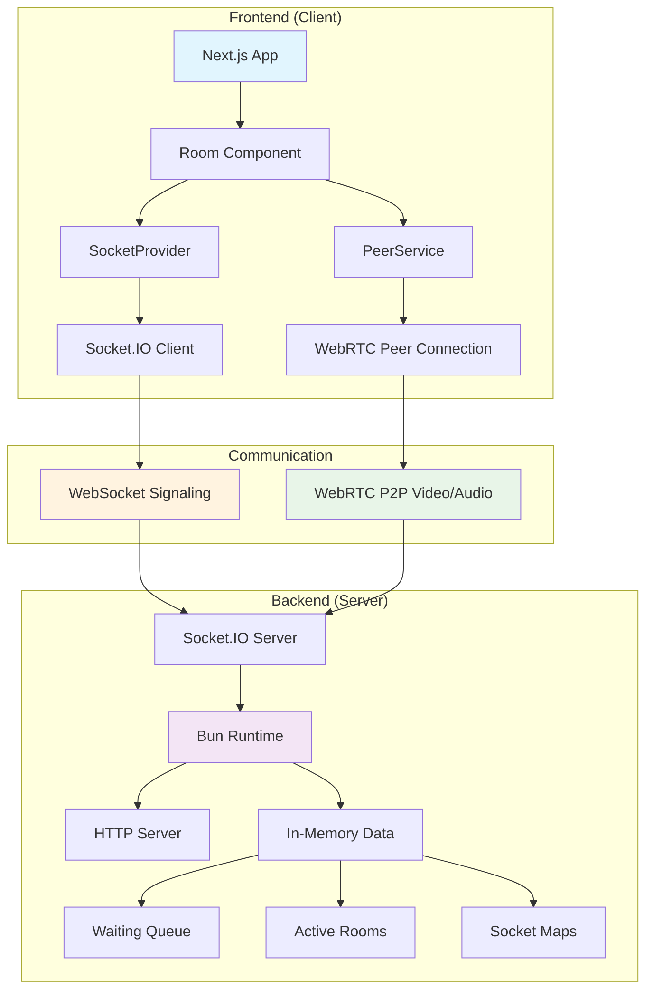

# Threadr Application Architecture - Detailed Mermaid Diagrams

## 1. High-Level Architecture Overview

## Summary

This Threadr application is a real-time video chat platform similar to Omegle, built with:

- **Frontend**: Next.js + React + TypeScript + Socket.IO Client + WebRTC
- **Backend**: Node.js + Socket.IO Server + Express
- **Communication**: WebSocket for signaling, WebRTC for P2P video/audio
- **Matching**: Queue-based random pairing system
- **State Management**: In-memory data structures (scalable with Redis)
- **Deployment**: Single server for small scale, horizontal scaling for large scale

Key features include automatic media access, real-time matching, WebRTC video calls, and graceful error handling with reconnection logic.