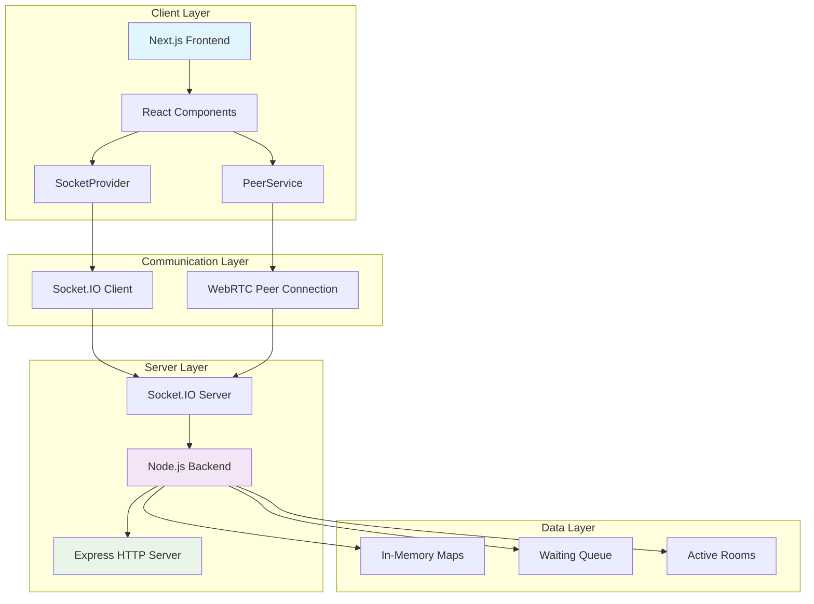
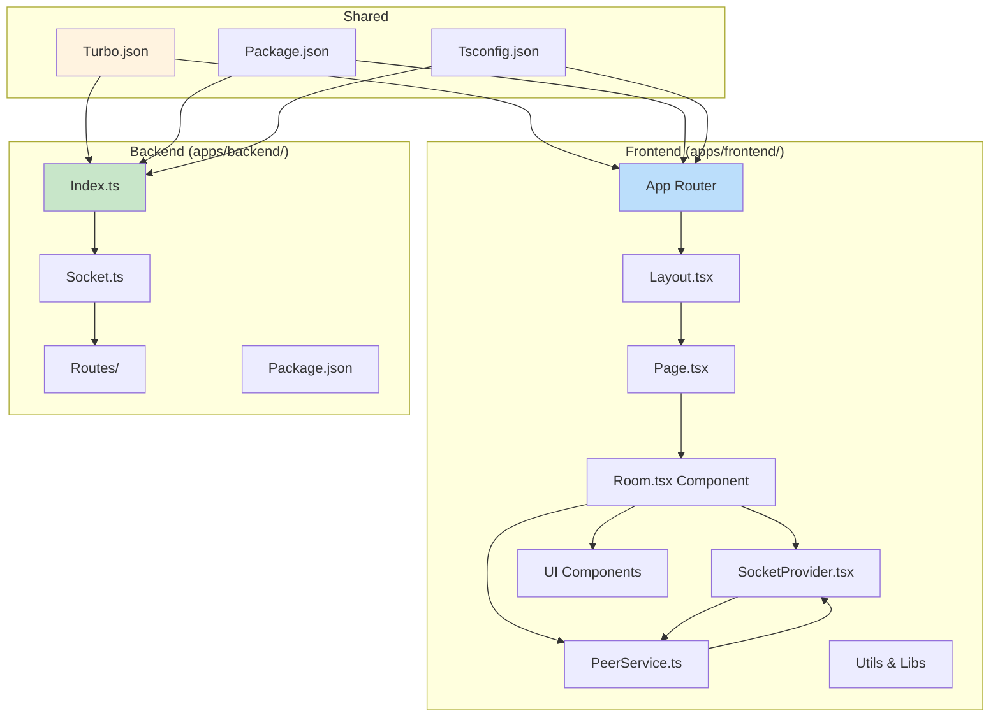
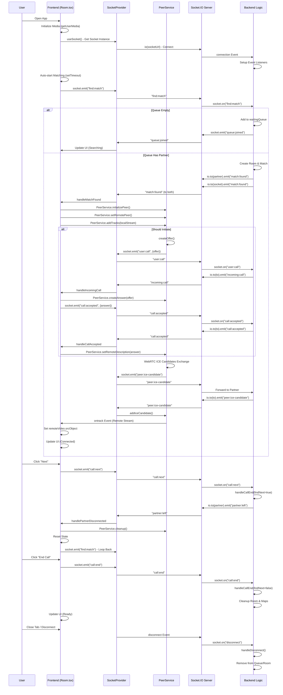
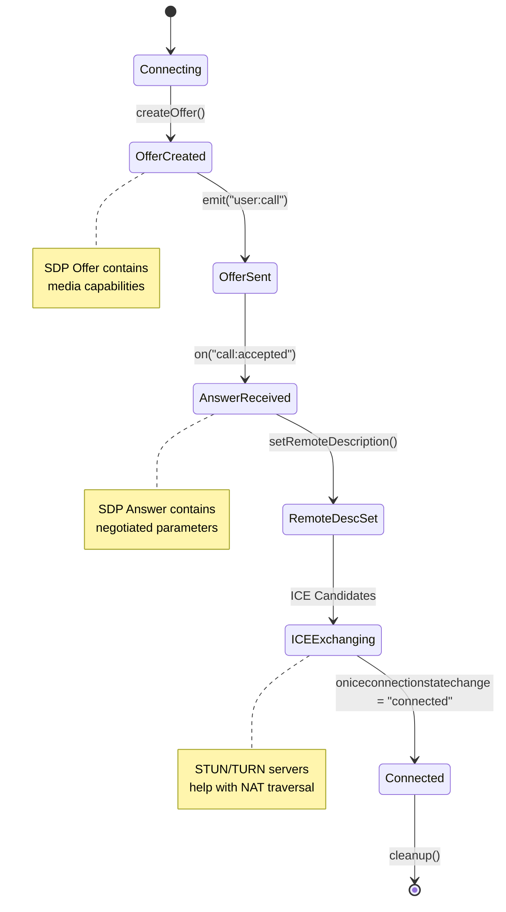
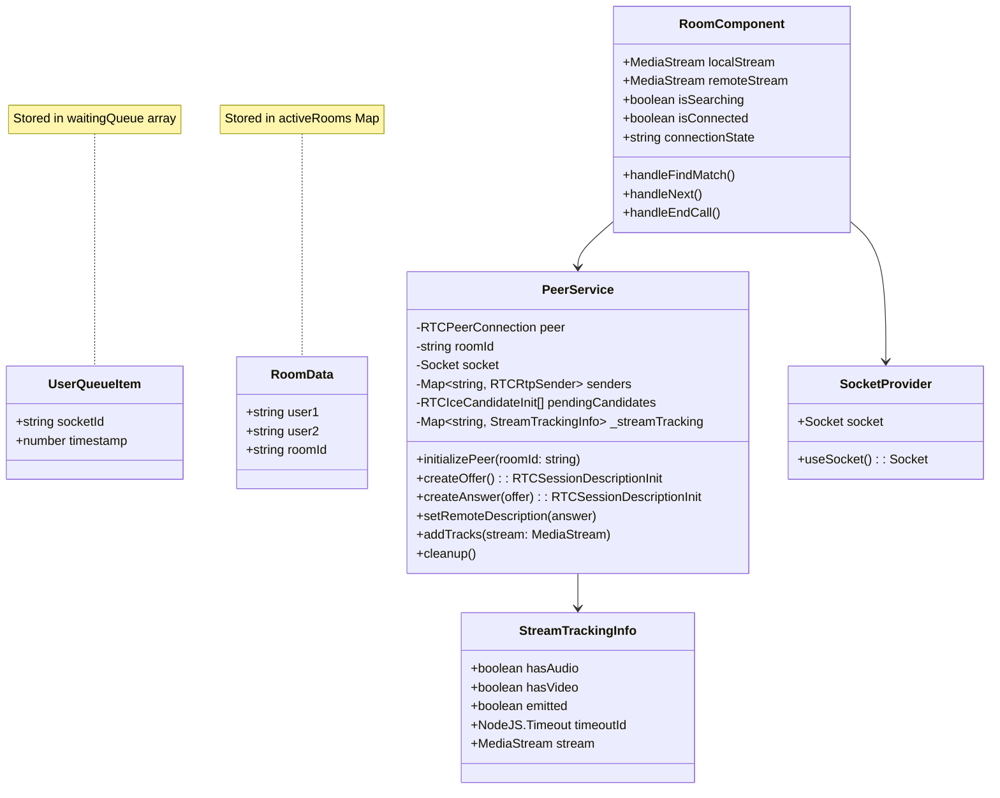
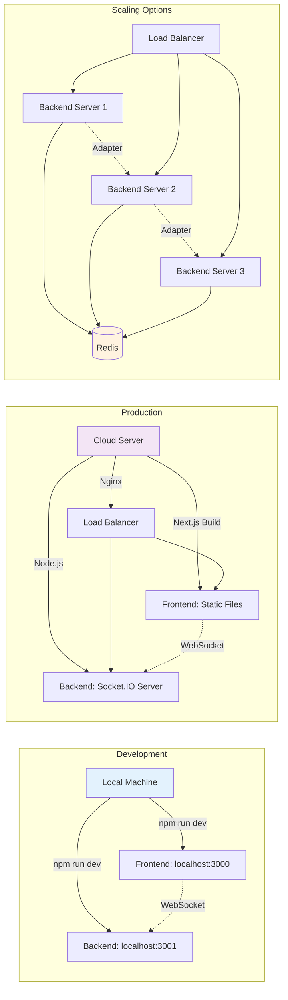
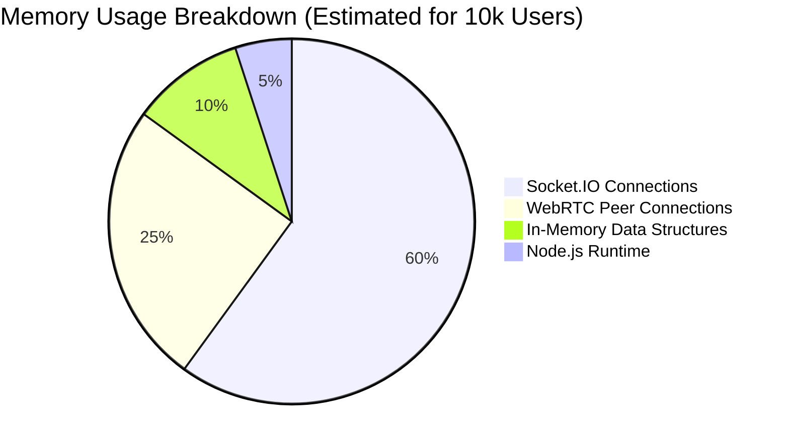
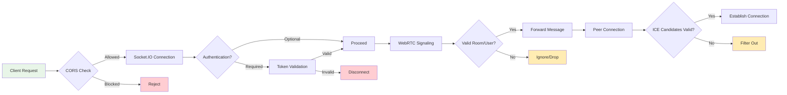

# Threadr Application Architecture - Detailed Mermaid Diagrams

## 1. High-Level Architecture Overview



## 2. Component Breakdown



## 3. User Flow Sequence Diagram



## 4. WebRTC Signaling Flow



## 5. Backend Event Handling Flowchart

```mermaid
flowchart TD
    A[Socket Connects] --> B{Event Type?}

    B -->|find:match| C[Check if in Queue]
    C -->|Already in Queue| D[Emit "queue:joined"]
    C -->|Not in Queue| E{Check Queue Length}
    E -->|>0| F[Pop Partner from Queue]
    E -->|=0| G[Add to Queue, Emit "queue:joined"]

    F --> H[Create Room ID]
    H --> I[Join Both Sockets to Room]
    I --> J[Update Maps: activeRooms, socketToRoomMap, socketToPartnerMap]
    J --> K[Emit "match:found" to Partner (shouldInitiate=true)]
    K --> L[Emit "match:found" to Current (shouldInitiate=false)]

    B -->|user:call| M[Forward Offer to Target]
    M --> N[Emit "incoming:call" to Target]

    B -->|call:accepted| O[Forward Answer to Target]
    O --> P[Emit "call:accepted" to Target]

    B -->|peer:ice-candidate| Q[Forward ICE Candidate to Target]
    Q --> R[Emit "peer:ice-candidate" to Target]

    B -->|peer:nego:needed| S[Forward Negotiation Offer]
    S --> T[Emit "peer:nego:needed" to Target]

    B -->|peer:nego:done| U[Forward Negotiation Answer]
    U --> V[Emit "peer:nego:final" to Target]

    B -->|call:next| W[handleCallEnd(findNext=true)]
    B -->|call:end| W

    W --> X[Notify Partner "partner:left"]
    X --> Y[Leave Room, Delete Maps]
    Y --> Z{findNext?}
    Z -->|true| AA[Emit "ready:next" to Current]
    Z -->|false| BB[End]

    B -->|disconnect| CC[handleDisconnect()]
    CC --> DD[Remove from Queue/Room]
    DD --> EE[Notify Partner if in Call]

    style A fill:#e8f5e8
    style B fill:#fff3e0
    style L fill:#c8e6c9
    style BB fill:#ffcdd2
```

## 6. Data Structures and State Management



## 7. Deployment and Infrastructure



## 8. Error Handling and Recovery

```mermaid
flowchart TD
    A[Error Occurs] --> B{Error Type?}

    B -->|WebRTC Connection| C[PeerService.handleConnectionFailure()]
    B -->|Socket Disconnect| D[handlePartnerDisconnected()]
    B -->|Media Access| E[setError("Failed to access camera/microphone")]
    B -->|ICE Candidate| F[addIceCandidate() with Retry]

    C --> G{Reconnect Attempts < Max?}
    G -->|Yes| H[Increment Attempts, Wait, Retry]
    G -->|No| I[Emit "error", Cleanup]

    D --> J[Set State to "disconnected"]
    D --> K[Cleanup PeerService]
    D --> L[Auto-reconnect after 1s]

    F --> M[Add to pendingCandidates]
    F --> N[Process when remoteDescription set]

    I --> O[User Sees Error Message]
    L --> P[Find New Match]

    style A fill:#ffcdd2
    style O fill:#ffecb3
    style P fill:#c8e6c9
```

## 9. Performance Considerations



```mermaid
gantt title Performance Timeline
    dateFormat HH:mm:ss
    axisFormat %H:%M

    section User Journey
    Page Load          :done, 00:00:00, 2s
    Media Access       :done, 00:00:02, 1s
    Socket Connect     :done, 00:00:03, 0.5s
    Find Match         :active, 00:00:03.5, 5s
    WebRTC Signaling   : 00:00:08.5, 3s
    Connected          : 00:00:11.5, 300s
```

## 10. Security Considerations



## Summary

This Threadr application is a real-time video chat platform similar to Omegle, built with:

- **Frontend**: Next.js + React + TypeScript + Socket.IO Client + WebRTC
- **Backend**: Node.js + Socket.IO Server + Express
- **Communication**: WebSocket for signaling, WebRTC for P2P video/audio
- **Matching**: Queue-based random pairing system
- **State Management**: In-memory data structures (scalable with Redis)
- **Deployment**: Single server for small scale, horizontal scaling for large scale

Key features include automatic media access, real-time matching, WebRTC video calls, and graceful error handling with reconnection logic.